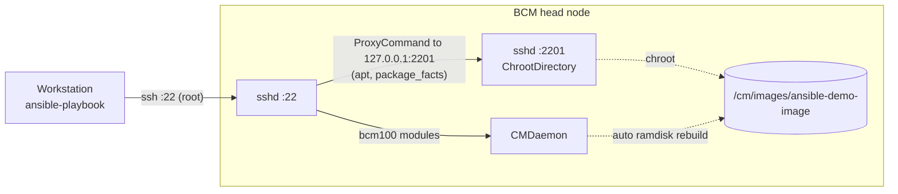

# bcm-ansible-demo

A hands-on demo of managing an **NVIDIA Base Command Manager (BCM) 10** cluster
with Ansible and the [`brightcomputing.bcm100`](https://galaxy.ansible.com/ui/repo/published/brightcomputing/bcm100/)
Galaxy collection. It shows how to:
- query the cluster;
- create and modify CMDaemon objects idempotently;
- run day-2 operations on nodes;
- install packages *inside* a software image.

`99_teardown.yml` puts the cluster back the way it was.

**How it works, in brief:** the bcm100 modules run on the **head node**, as
root, where they talk to the local CMDaemon. To work inside a software image,
the playbooks temporarily open an SSH "tunnel" whose sessions are chrooted
into the image. After that, ordinary modules like `apt` work there. For
details, see [How it works](#how-it-works).

> [!WARNING]
> These playbooks change a live cluster. `05_rolling_reboot.yml` reboots
> nodes, and `06_image_packages.yml` clones a multi-GiB software image and
> temporarily reconfigures and restarts **sshd on the head node**. Use a lab or
> test cluster, check [what each playbook changes](#playbooks), and try
> `--check` first.

**Getting started:** [Requirements](#requirements) ·
[Quick start](#quick-start) ·
[Choosing your settings](#choosing-your-settings) ·
[Playbooks](#playbooks) ·
[Running the demo](#running-the-demo) ·
[Troubleshooting](#troubleshooting)<br>
**Background:** [How it works](#how-it-works) ·
[Variables](#variables) ·
[Documentation](#documentation) ·
[Collection quirks](#collection-quirks-and-workarounds) ·
[Development](#development) ·
[Reference lab](#reference-lab) ·
[License](#license)

## Requirements

**Workstation:**
- [uv](https://docs.astral.sh/uv/), which provides Python 3.12 and installs
  Ansible and the other tools from `pyproject.toml`.
- SSH access to the head node.

**Head node:**
- **BCM 10.x.**
- **Root SSH login by key** allowed (`PermitRootLogin` of `yes` or
  `prohibit-password`).
- **An unprivileged user with passwordless sudo.** This is only needed to
  authorize a new key for root. See step 3 of the Quick start.
- **For `06_image_packages.yml`:** a Debian/Ubuntu software image to clone,
  enough free space on `/cm/images` for a copy of it plus 10 GiB, and a free
  port on the head node (2201 by default).

`00_preflight.yml` checks all of these, plus BCM's own prerequisites (root's
CMDaemon certificate and `cm-python3` libraries). It reports any problem
before anything is changed.

## Quick start

Run everything from the repo root, so `ansible.cfg` is picked up. If you
activate the venv (`source .venv/bin/activate`, or direnv), you can drop the
`uv run` prefix.

**1. Install the tools and collections.**

```bash
git clone https://github.com/RHudsonH/bcm-ansible-demo.git && cd bcm-ansible-demo
uv sync
uv run ansible-galaxy collection install -r collections/requirements.yml   # into ./collections
```

The collection install downloads from galaxy.ansible.com (about 30 s), so the
workstation needs internet access for this step.

**2. Create your site configuration.**

```bash
cp inventory/hosts.example.yml inventory/hosts.yml   # gitignored; your values stay local
```

In `inventory/hosts.yml`, set the head node address
(`bcm-head.ansible_host`) and the SSH key (`ansible_ssh_private_key_file`).
Leave the `<CATEGORY>` values for step 4.

**3. Give Ansible root access with a key.**

> [!TIP]
> **Already have a key authorized for root on the head node?** Put its path
> in `ansible_ssh_private_key_file`, and skip this step. `bootstrap_user` can
> stay `<SUDO_USER>`.

Otherwise, create a dedicated key and let `bootstrap.yml` authorize it for
root. It logs in once as your sudo user (set `bootstrap_user`):

```bash
ssh-keygen -t ed25519 -f ~/.ssh/bcm_ansible_demo -C "bcm-ansible-demo"
ssh-copy-id -i ~/.ssh/bcm_ansible_demo.pub <sudo-user>@<head-node>   # also records the host key
uv run ansible-playbook playbooks/bootstrap.yml
```

**4. Choose the categories and image.**

```bash
uv run ansible-playbook playbooks/01_cluster_facts.yml   # read-only; works before step 4 is done
```

This lists your nodes and categories, and `images_by_category` shows the
image each category boots. Set `demo_node_category`, `reboot_category` and,
optionally, `demo_image_clone_from`. See
[Choosing your settings](#choosing-your-settings).

**5. Run the preflight check.**

```bash
uv run ansible-playbook playbooks/00_preflight.yml
```

It checks your settings and the head node, then prints what the demo will
use, including how many nodes 04 and 05 will touch. When it passes, you're
ready for [Running the demo](#running-the-demo).

## Choosing your settings

All site-specific settings live in `inventory/hosts.yml`, your copy of
`inventory/hosts.example.yml`.

| Setting | Template value | What it's for |
|---|---|---|
| `bcm-head.ansible_host` | `<HEAD_NODE_ADDRESS>` | Hostname or IP of the head node. The inventory name `bcm-head` is just a label. |
| `ansible_ssh_private_key_file` | `~/.ssh/bcm_ansible_demo` | The key Ansible logs in with, as root. |
| `bootstrap_user` | `<SUDO_USER>` | The sudo user `bootstrap.yml` logs in as. Only needed for bootstrap. |
| `demo_category_clone_from` | `default` | 02: the category to clone. |
| `demo_image_clone_from` | `default-image` | 06: the image to clone. It must be Debian/Ubuntu. |
| `demo_node_category` | `<CATEGORY>` | 04: sets `userdefined2` on **every node** in this category. |
| `reboot_category` | `<CATEGORY>` | 05: **reboots every node** in this category, one at a time. |
| `ansible-demo-image.ansible_port` | `2201` | 06: the tunnel port. Any port that's free on the head node. |

**Picking values:**
- **Node categories (04, 05):** choose a category of nodes you can safely
  reboot, such as test compute nodes, and not login or service nodes that
  users depend on. 04 refuses to overwrite a `userdefined2` value it didn't
  set.
- **Image (06):** `default-image` exists on every cluster. The image your
  node category boots (from `images_by_category`) is a more realistic
  choice. 06 never changes the source image; it works on a clone.
- **Category to clone (02):** `default` exists on every cluster, and 02 only
  clones it.

## Playbooks

Everything the demo creates is named with the prefix `ansible-demo-`. Timings
are from the [reference lab](#reference-lab), and scale with image size and
node boot time.

| Playbook | What it changes | `--check` | Re-run | Time |
|---|---|---|---|---|
| `bootstrap.yml` | Adds your key to root's `authorized_keys`. Not undone by teardown. | Preview | No-op | seconds |
| `00_preflight.yml` | Nothing. Checks settings, head node and 06's needs. | n/a | Same | ~15 s |
| `01_cluster_facts.yml` | Nothing. Prints nodes, categories, images, networks and Slurm, and saves `facts/<host>.json` locally. | Doesn't save | Same | ~15 s |
| `02_category.yml` | Clones a category into `ansible-demo-cat`. | Shows "changed" | `changed=0` | ~5 s |
| `03_user_group.yml` | Creates the LDAP user `ansible-demo-user` and group `ansible-demo-group`. The password goes in `credentials/`, which is gitignored. | Shows "changed" | `changed=0` | ~5 s |
| `04_node_settings.yml` | Sets `userdefined2` on each node in `demo_node_category`, printing each change. | Shows the changes | `changed=0` | ~10 s |
| `05_rolling_reboot.yml` | **Reboots** each node in `reboot_category`, one at a time. Needs `-e confirm_reboot=yes`. | Shows the plan | Reboots again | ~2 min/node |
| `06_image_packages.yml` | Clones the image into `ansible-demo-image`, opens the tunnel (restarts **sshd**), installs `btop` in the clone, and closes the tunnel. | Disk check and preview | Reuses the clone | ~8–9 min |
| `99_teardown.yml` | Closes any leftover tunnel, and removes the demo category, user, group, node tag and image, including its files. | Preview | `changed=0` | 1–4 min |

**What teardown removes:** exactly the objects named in
`inventory/group_vars/all.yml`, nothing else. Before it deletes the image
directory, it checks:
- the name has the demo prefix;
- the path is exactly `/cm/images/<demo_image>`;
- CMDaemon no longer uses that name or path;
- nothing is mounted under it.

**What it leaves:** the key from `bootstrap.yml`, and the tunnel role's
one-time change of `#Port 22` to `Port 22` in `sshd_config`. That change is
needed, because a second `Port` line would otherwise make sshd stop
listening on 22.

## Running the demo

```bash
uv run ansible-playbook playbooks/00_preflight.yml
uv run ansible-playbook playbooks/01_cluster_facts.yml       # the cluster, as data

uv run ansible-playbook playbooks/02_category.yml --check    # dry run: "changed", nothing committed
uv run ansible-playbook playbooks/02_category.yml            # create
uv run ansible-playbook playbooks/02_category.yml            # idempotent: changed=0

uv run ansible-playbook playbooks/03_user_group.yml
uv run ansible-playbook playbooks/04_node_settings.yml       # prints each change, e.g. userdefined2: "" -> "..."

uv run ansible-playbook playbooks/05_rolling_reboot.yml --check                # the plan
uv run ansible-playbook playbooks/05_rolling_reboot.yml -e confirm_reboot=yes  # the real thing

uv run ansible-playbook playbooks/06_image_packages.yml      # clone the image, install btop inside it
uv run ansible-playbook playbooks/99_teardown.yml
```

**Showing enforcement with 02:** change the demo category by hand, for
example `cmsh -c 'category; use ansible-demo-cat; set defaultgateway 10.99.99.1; commit'`.
Then re-run 02: it reports `defaultGateway: "10.99.99.1" -> "0.0.0.0"` and
puts it back.

**During 05:** it prints many `FAILED - RETRYING: ... Wait for node to ...`
lines. That's normal: it's how Ansible's `until` loop shows each poll of the
node's status.

**During 06:** most of the time goes on CMDaemon cloning the image and
rebuilding its ramdisks, and a task can sit silent for a few minutes.

**After 06:** the clone keeps `btop` until teardown. On the head node:

```bash
chroot /cm/images/ansible-demo-image dpkg -s btop     # "Status: install ok installed"
cm-chroot-sw-img /cm/images/ansible-demo-image        # or look around interactively
```

- **Check inside the image.** Packages on the head node itself say nothing
  about the image. BCM head nodes may have `btop` installed themselves.
- **Exit any `cm-chroot-sw-img` shell before teardown.** Otherwise teardown
  waits up to 3 minutes for it, and then refuses.

## Troubleshooting

| Symptom | Cause and fix |
|---|---|
| Preflight: "'…' is not set" | A placeholder is still in `inventory/hosts.yml`. Run `01_cluster_facts.yml` to see valid values. |
| `Permission denied (publickey)` | The key isn't authorized: for the sudo user during bootstrap, or for root afterwards. Redo step 3 of the Quick start. |
| `Host key verification failed` | The head node isn't in `~/.ssh/known_hosts`. SSH to it once by hand. |
| Preflight or 06: "Cloning … would leave Y GiB free" | Free up space on `/cm/images`, choose a smaller image, or lower `image_clone_min_free_gib`, carefully. |
| Preflight: "Port … is already in use" | Pick another `ansible_port` for the image host, or run `99_teardown.yml` if a demo tunnel was left open. |
| 04: "userdefined2 already set to …" | A node uses that field for something else. Choose another category, or clear the field. |
| 05: "Not UP: …" | A target node is already down or booting. Fix it first, or choose another category. |
| 06 or teardown: "Still running after 900s" | A CMDaemon background task hasn't finished (see `cmsh -c 'task; list'`). Wait for it, or cancel it with `task; cancel <id>`, then re-run. On slow clusters, raise `cmdaemon_task_timeout`. |
| 06 or teardown: "Processes are still running inside a software image" | Usually an open `cm-chroot-sw-img` shell (exit it), or a long CMDaemon ramdisk build (wait). Then re-run. |
| Tunnel left open after an interrupted 06 | Run `99_teardown.yml`. It closes the tunnel, and restarts sshd if the port is still open. |
| `ERROR: Ansible requires blocking IO on stdin/stdout/stderr` | The shell running `ansible-playbook` uses non-blocking pipes, as some automation and AI coding tools do. Use a normal terminal, or redirect the output to a file (`... > run.log 2>&1`). |

---

## How it works

### Running on the head node, as root

Ansible copies each bcm100 module to the head node and runs it there under
BCM's bundled `/cm/local/apps/python3/bin/python`. That interpreter ships
`pythoncm`, CMDaemon's Python binding. `pythoncm` authenticates with the
**calling user's** `~/.cm/admin.pem`, so the playbooks connect as root and use
`/root/.cm/admin.pem`. This matches how BCM and the collection are designed
to be used. Your workstation needs only Ansible.

### Working inside a software image

The collection's `software_image_tunnels_open` and `_close` roles (thin
wrappers around `software_image_tunnels`) make an image under `/cm/images`
reachable as an SSH host.

**Opening a tunnel:**
1. It bind-mounts `/dev`, `/proc` and `/sys` into the image, and copies the
   head node's `resolv.conf` in.
2. It adds a second sshd port whose sessions are chrooted into the image:
   `Match LocalPort 2201` → `ChrootDirectory /cm/images/<image>`.
3. It restarts sshd.

The image is then an inventory host in the `software_images` group, and
ordinary modules like `apt` work inside it.

**Connecting:** as in [NVIDIA's knowledge base article](#documentation),
Ansible logs in to the head node on port 22 and hops to `127.0.0.1:2201`
with a `ProxyCommand`. So the tunnel port never has to be reachable from your
workstation. Unlike NVIDIA's example, which sets `StrictHostKeyChecking=no`,
host keys are still checked, using `HostKeyAlias` and the head node's
existing `known_hosts` entry.



### CMDaemon's automatic ramdisk rebuilds

After an image is cloned, and after every package change, CMDaemon rebuilds
the image's ramdisks by itself. It runs two background tasks of about 2
minutes each, which chroot into the image and run `mkinitramfs` with their
own mounts. Changing or deleting the image meanwhile races with them. So
`playbooks/tasks/wait_cmdaemon_tasks.yml` waits until `cmsh -c 'task; list'`
shows no unfinished tasks. It runs before `apt` in a fresh clone, before
closing the tunnel, and before teardown removes the image.

### Closing tunnels safely

`playbooks/tasks/close_image_tunnels.yml` wraps the collection's close role:
- **Before closing:** it refuses, naming the process, while anything is still
  running inside the image.
- **After closing:** it restarts sshd if the tunnel port is still open. The
  role can skip that restart; see
  [Collection quirks](#collection-quirks-and-workarounds).

## Variables

Generic settings, in `inventory/group_vars/all.yml` unless noted. Override any
of them with `-e`. For the site settings, see
[Choosing your settings](#choosing-your-settings).

| Variable | Default | Used by |
|---|---|---|
| `demo_prefix` | `ansible-demo` | Name prefix for everything the demo creates |
| `demo_category` | `ansible-demo-cat` | 02 |
| `demo_user`, `demo_group` | `ansible-demo-user`, `ansible-demo-group` | 03 |
| `demo_node_value` | `ansible-demo: managed by ansible` | 04 |
| `confirm_reboot` | `no` (play var) | 05. It must be `yes` for a real run. |
| `reboot_down_timeout`, `reboot_up_timeout`, `reboot_poll_interval` | `300`, `900`, `10` (seconds) | 05, per node |
| `demo_image` | `ansible-demo-image` | 06. It must match the image host's name in `inventory/hosts.yml`; if you change `demo_prefix`, rename that host too. |
| `demo_image_packages` | `[btop]` | 06 |
| `image_clone_min_free_gib` | `10` | 00 and 06. The free space that must remain after cloning. |
| `demo_image_root` | `/cm/images` | Don't change it: the tunnel role hard-codes this path. |
| `cmdaemon_task_timeout` | `900` (seconds) | 06 and teardown. Set in `group_vars/bcm_head.yml`. |

## Documentation

NVIDIA's official material on this collection is thin:

- **[Managing software images as Ansible inventory hosts](https://enterprise-support.nvidia.com/s/article/managing-software-images-as-ansible-inventory-hosts)**
  (NVIDIA Enterprise Support, June 2026). This is the only documentation of
  the tunnel roles; their READMEs in the collection say "TBD".
  - **Old content:** it's the old Bright KB article, which still refers to
    the pre-BCM 10 `brightcomputing.bcm` collection. It applies equally to
    `bcm100`.
  - **Support scope:** it states that **Ansible integration is outside BCM's
    scope of support**.
  - **Its caveat:** there's no running systemd inside the chroot, so
    `service` can enable or disable services in an image, but can't start or
    stop them.
  - **Its example has a bug:** the custom-group example's
    `close-tunnels.yml` applies the `_open` role.
- **[BCM 10 Administrator Manual](https://support.brightcomputing.com/manuals/10/admin-manual.pdf)**,
  section 16.10. It covers the modules, with examples run as root on the head
  node, but doesn't mention the tunnel roles.
- **Example playbooks** on the head node, in `/cm/local/examples/cmd/ansible/`.
- **Module docs:** `ansible-doc brightcomputing.bcm100.<module>`. Only 13 of
  180 modules have examples.

Old Bright KB articles now live at
`https://enterprise-support.nvidia.com/s/article/<same-slug>`.

## Collection quirks and workarounds

These apply to bcm100 `30.0.49768+git157f529`, pinned in
`collections/requirements.yml`. Where checked, the BCM 11 collection,
`brightcomputing.bcm110` `33.0.53531`, has identical code.

1. **Unset options with defaults are still sent to CMDaemon.**
   `module_utils/base_module.py` `filter_params()` only drops unset options
   whose default is `None`, so every other default is applied as if you had
   set it.
   - For `physical_node` that includes `mac: 00:00:00:00:00:00`. CMDaemon
     rejects that on a node that's up, and would **wipe the MAC of a node
     that's down**.
   - **Workaround:** pass each such option with the object's current value.
     See `playbooks/tasks/set_node_userdefined2.yml`, and the clones in 02 and
     06.
   - NVIDIA's own examples quietly pass `mac` too, for the same reason.
2. **The tunnel roles have gaps:**
   - They need `ansible.posix` but don't declare it. It's added in
     `requirements.yml`.
   - They use the deprecated injected fact `ansible_os_family`, planned for
     removal in ansible-core 2.24. Plays that use them set it from
     `ansible_facts`.
   - Close restarts sshd from a handler. If a later task fails, the restart
     never happens, and re-running close changes nothing, so the port stays
     open. This is handled by `tasks/close_image_tunnels.yml` and
     `force_handlers: true`.
   - They hard-code `/cm/images`.
3. **CMDaemon keeps the files when an image is removed.** Teardown deletes
   the directory after its safety checks.
4. **CMDaemon rebuilds ramdisks after image changes.** Deleting an image
   mid-build makes the task fail. See
   [How it works](#cmdaemons-automatic-ramdisk-rebuilds).
5. **Don't run `apt autoremove` in an image through the tunnel.** Inside a
   chroot, apt judges kernels by the *head node's* running kernel, so it
   could purge the image's own. To undo an install, purge exactly the
   packages it added; 06 lists them.
6. **Other gaps:**
   - There are no reboot or image-update modules, so 05 uses `cmsh`.
   - Module diffs don't show with `--diff`, so 04 prints them itself.
   - The `bright_nodes` inventory plugin needs `pythoncm` on the
     controller, so it isn't used here.

## Development

```bash
uv run ansible-lint              # production profile (.ansible-lint); must pass
uv run pre-commit install        # optional: lint and hygiene checks on every commit
```

```
ansible.cfg                  inventory path, ./collections, yaml output, pipelining
collections/requirements.yml pinned bcm100 + ansible.posix (installed into ./collections, gitignored)
inventory/hosts.example.yml  site configuration template (copy to inventory/hosts.yml, gitignored)
inventory/group_vars/        generic demo settings (all.yml), head-node paths (bcm_head.yml)
playbooks/                   bootstrap, 00-06, 99_teardown
playbooks/tasks/             shared tasks: node update, reboot, clone space, close tunnels, wait for CMDaemon
facts/, credentials/         local output (gitignored contents)
```

**Porting to BCM 11:** replace `brightcomputing.bcm100` with
`brightcomputing.bcm110` in the playbooks, task files and `requirements.yml`,
and change the version check in `00_preflight.yml`. Every module used here
exists in bcm110.

## Reference lab

Developed and tested against a BCM 10.0 lab cluster on Ubuntu 22.04: one head
node and seven VM nodes across six categories. Every playbook was run end to
end there, including real rolling reboots and image package installs. The
VMs have no power control, so 05 reboots them through CMDaemon.

## License

[MIT](LICENSE) for the files in this repository. The collections that
`collections/requirements.yml` installs aren't part of this repo, and keep
their own licenses: `brightcomputing.bcm100` is under NVIDIA's proprietary
license, and `ansible.posix` is under GPL-3.0.
